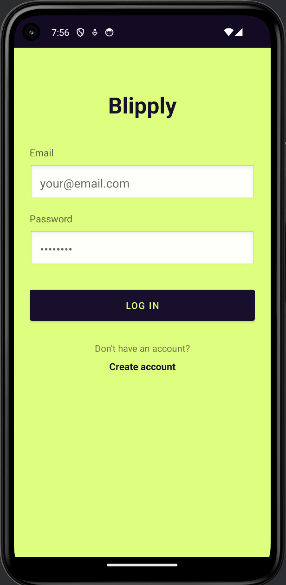
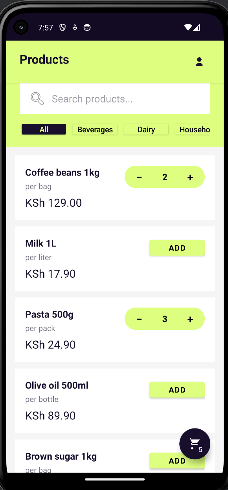
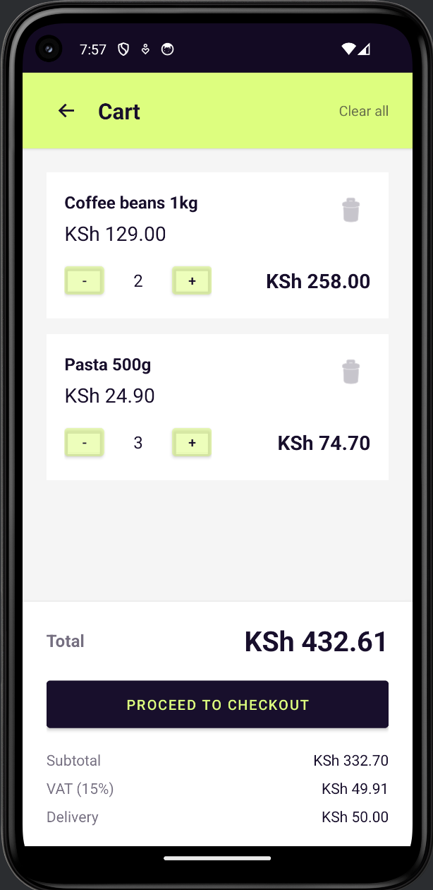

## Requirements
- macOS, Windows eller Linux  
- Git  
- JDK 17 (JAVA_HOME måste peka på JDK 17)  
- Android Studio (rekommenderas)  
- Android SDK (plattform + build-tools)  
- Emulator eller fysisk Android‑enhet  
- ADB tillgängligt i PATH (eller via Android Studio)  

## Run the app
1. Klona projektet:
   ```bash
   git clone https://github.com/julnor124/BlipplyPrototype.git
   cd BlipplyPrototype
   ```
2. Starta en emulator i Android Studio (eller koppla in en fysisk enhet med USB‑debugging).
3. Verifiera att en enhet finns ansluten:
   ```bash
   adb devices
   ```
   Du ska se en enhet i listan.
4. Installera appen:
   ```bash
   ./gradlew installDebug
   ```
5. Starta appen via ADB:
   ```bash
   adb shell am start -n com.example.blipplyprototype/.ui.auth.LoginActivity
   ```

## Build (optional)
```bash
./gradlew build
```

## Clean (optional)
```bash
./gradlew clean
```

## Run tests
```bash
./gradlew test
```

## Run UI tests (instrumented)
```bash
./gradlew connectedAndroidTest
```

## Screenshots




## Troubleshooting
- `JAVA_HOME` pekar inte på JDK 17: kontrollera att rätt JDK är installerat och att `java -version` visar 17.
- `adb devices` visar ingen enhet: starta emulatorn igen eller kontrollera USB‑debugging på telefon.
- `adb` saknas i PATH: använd Android Studio (SDK Manager) eller lägg till `platform-tools` i PATH.

## Scope och avgränsningar

Detta är en prototyp och flera förenklingar har därför gjorts:

- All data är mockad och ingen riktig backend används  
- Inloggning och konto­skapande är simulerade  
- Ingen persistent lagring används, all state hålls i minnet  
- Applikationen återställs vid omstart  
- Utvecklingen har skett på en och samma git-branch för enkelhet i prototypfasen och för att jag varit själv med att committa.
- Jag har försökt hålla logiska, beskrivande commits per funktion eller ändring.

Dessa avgränsningar gjordes för att kunna fokusera på huvudflöden, struktur och tydlighet snarare än full implementation. Dessa saker skulle givetvis fixas i en verklig app.


## Architecture

Projektet är uppdelat i enkla lager för att hålla koden lättläst och tydlig:

### ui/
Activities och Fragments som ansvarar för presentation, navigation och användarinteraktion.

### data/
Modeller och repositories som hanterar applikationens state.

### data/mock/
Mockad data som ersätter backend och externa beroenden.

State hålls i repositories, till exempel `CartRepository` som singleton. Detta gör att flera skärmar kan dela samma data och hålla sig synkroniserade utan mer avancerad state-hantering.

Jag har valt att inte använda MVVM eller persistence i denna version. Det var ett medvetet beslut för att hålla lösningen enkel och fokusera på användarflöden istället för arkitekturkomplexitet.


## AI usage and decisions

Under utvecklingen använde jag **Cursor**.

Arbetet började med att jag använde AI för att snabbt komma igång, till exempel genom förslag på struktur, layout och hur olika användarflöden kunde kopplas ihop och för att hjälpa till med syntax då jag inte programmerat jättemycket i java innan.

I vissa fall valde jag att inte använda föreslagna lösningar. Detta berodde ofta på att lösningen kändes onödigt komplex för uppgiftens scope eller inte tillförde tillräckligt mycket värde i en prototyp. Ett exempel är när jag trodde att jag hade problem med scrollfunktionen, och den gav mig en extremt onödig lösning när jag insåg att det enbart krävdes en rad kod.


## Reflection

### Vad prioriterade du från kravspecifikationen och varför?

Jag började med att prioritera det som explicit krävdes i uppgiften. Det innebar att fokusera på de centrala användarflödena:

- att en inloggad merchant kan bläddra i en grossists produktkatalog  
- att skapa en order med en eller flera produkter  
- att välja betalningssätt (advance payment, kredit eller on site payment)  
- att visa en enkel ordersammanfattning där betalning och status hänger ihop  

Målet var först att få dessa flöden att fungera på ett tydligt och sammanhängande sätt. När jag kände mig nöjd med att grundkraven var uppfyllda och fortfarande hade tid kvar, valde jag att implementera ytterligare förbättringar och kompletterande funktionalitet. Jag hade en prototyp i Figma som jag utgick ifrån, vilket gjorde det lättare att snabbt implementera de olika skärmarna.


### Vilka antaganden gjorde du?

Under arbetet gjorde jag flera förenklande antaganden:

- att backend, kreditbedömning och betalningslogik kan mockas.
- att inloggning inte behöver verklig autentisering i en prototyp.
- att du inte behöver skapa en användare för att logga in.
- att state kan hållas i minnet utan persistence.
- att tydliga användarflöden är viktigare än full teknisk implementation.
- att samma person alltid kommer vara inloggad, detta var för att visa upp hur en profilsida skulle kunna se ut.

Dessa antaganden gjorde det möjligt att hålla fokus på struktur och användarupplevelse inom given tidsram, men också att kunna bygga fler funktioner i appen.


### Vad skulle du bygga härnäst om arbetet fortsatte?

Mycket hade behövt förbättras i denna app. Om arbetet fortsatte hade nästa steg varit att vidareutveckla lösningen stegvis. Först genom att:

- införa MVVM-arkitektur för att lättare kunna skala.
- lägga till persistent lagring (t.ex. Room eller DataStore).
- koppla applikationen till ett riktigt backend-API.
- för ett fintechbolag: Java/Spring Boot med PostgreSQL och JWT‑auth.

När den tekniska grunden var på plats hade det även varit intressant att utveckla funktionaliteten vidare, till exempel:

- mer realistisk kredit- och betalningslogik.
- förbättrad felhantering och testtäckning.

Ett område som hade varit särskilt intressant att utforska vidare är mer verklig AI-funktionalitet, till exempel AI-baserade produktrekommendationer eller smarta suggestions i checkout-flödet baserat på användarens beteende eller orderhistorik. Detta låg dock utanför scopet för uppgiften och prioriterades därför bort i denna version.
